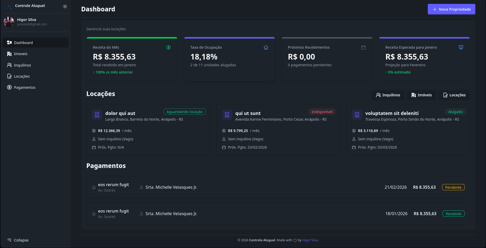

<h1 align="center">AlugueFacil</h1>

<a href="#project-description">Descrição</a> - <a href="#technology-stack">Tech Stack</a>

## Descrição

Esse projeto é uma plataforma para controle de contratos e pagamentos de aluguel. Ele permite cadastrar as propriedades, inquilinos e fazer o acompanhamento mensal dos pagamentos. A aplicação faz a criação dos pagamentos automaticamente, deixando o usuários apenas responsável por registrar o pagamento, o sistema também possibilita a autenticação usando Gmail.

Esse projeto utiliza stack moderna é boas praticas para garantir uma experiência agradável aos usuários.

## Tech Stack

**Frontend**: Livewire, AlpineJs, Tailwind CSS

**Backend**: PHP, Laravel, Postgres

**Cloud & DevOps**: Oracle, Docker